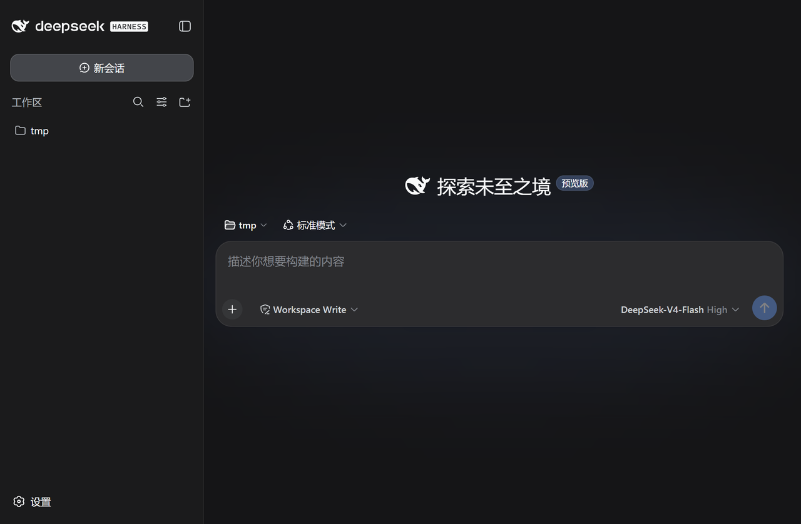
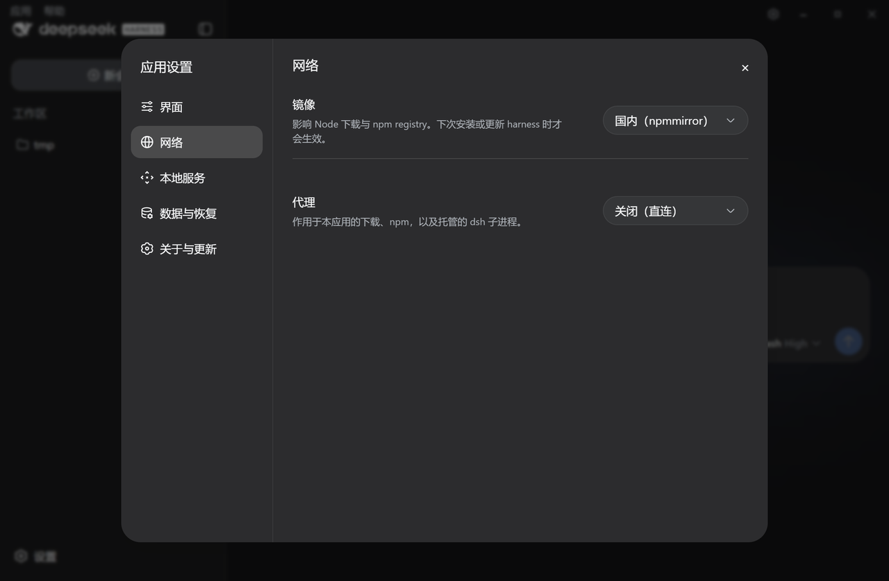
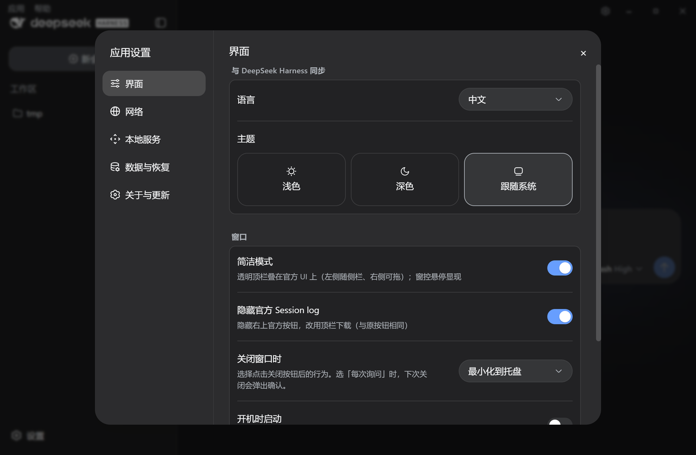
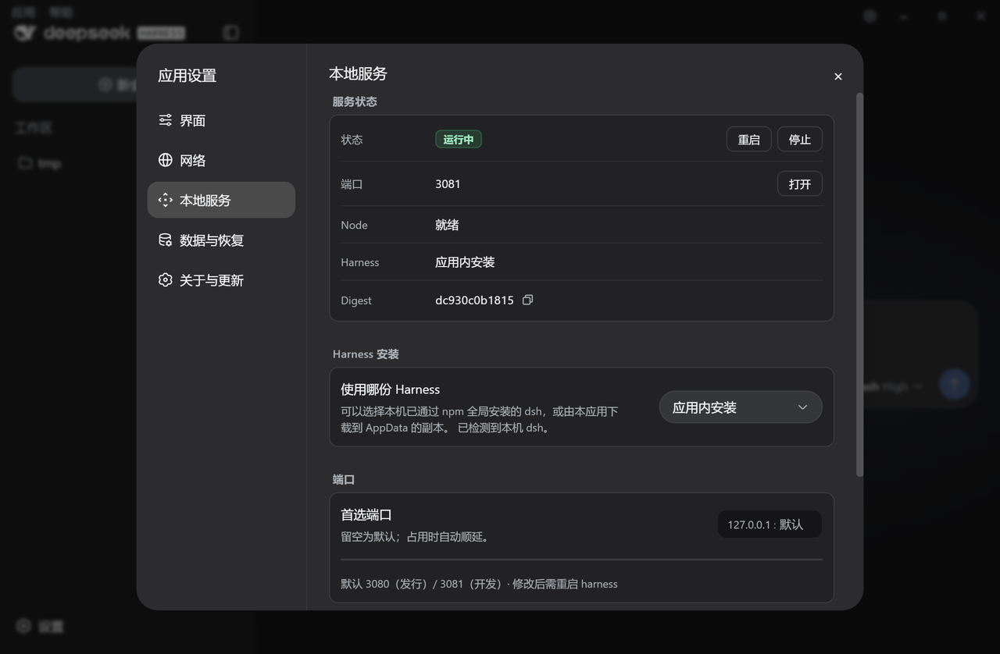
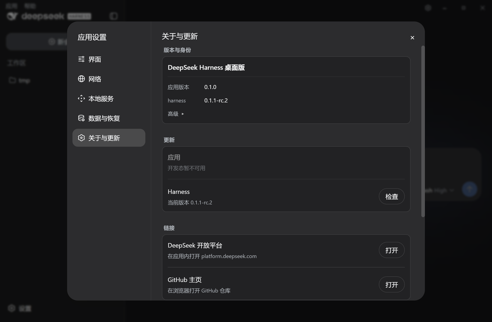

# deepseek-harness-desktop

[](https://github.com/MidiAug/deepseek-harness-desktop/releases/latest)
[](LICENSE)
[](https://github.com/MidiAug/deepseek-harness-desktop/releases/latest)

**中文** · [English](README.en.md)

# DeepSeek Harness 桌面版

**在 Windows 上打开 DeepSeek Harness——装好就能用，界面还是官方那套。**

不用先配 Node、不用先会敲命令行；公司代理和国内镜像在设置里就能配。  
已经用过命令行版的人：优先直接用你本机那份 `dsh`，会话还在原来的 `~/.dsh`。

> 社区项目，**不是** DeepSeek 官方出品。MIT 许可。

<p align="center">
  
</p>

## 下载

**→ [下载 Windows 安装包](https://github.com/MidiAug/deepseek-harness-desktop/releases/latest)**（`*-setup.exe`）

Windows 10/11 x64。若弹出 SmartScreen：点「更多信息」→「仍要运行」。  
用法见 [快速开始](docs/getting-started.md)。

## 为什么值得下一份

社区里已经有很热闹的桌面版（插件市场、多系统、侧栏……）。  
本仓库主打另一件事：**把卡人的环境问题做对，同时尽量不碰官方界面。**

具体会帮到你的：

1. **国内网 / 公司网** — 设置里可选 npmmirror，也可配系统代理或自定义 HTTP / SOCKS；装不上时也能从失败页进网络设置  
2. **你已经装过命令行** — 探测到本机 `dsh` 就直接进官方界面，不强迫再下一套；也可以改成「由应用准备一份」  
3. **数据和 CLI 是同一套** — 默认 `~/.dsh`，语言 / 主题跟官方设置文件同步，会话和插件能对上  
4. **关得干净、坏了能试** — 退出时尽量回收本次拉起的进程；可用「干净配置」试跑（不删正式数据），也可导出诊断包  
5. **不塞插件、不换皮** — 打开就是官方 Web UI；顶栏可开简洁模式，少挡界面  

<p align="center">
  
</p>
<p align="center">
  
</p>

## 该下谁：按你更在意什么选

没有「唯一正确」的桌面版——看你要什么：

| 你更在意…… | 建议 |
|------------|------|
| 插件市场、侧栏增强、Win / Mac / Linux、社区热闹 | [DSH Desktop (anywhere)](https://github.com/anywhere-labs/dsh-desktop)、[dsh-tauri-desk](https://github.com/dsh-tauri-desk/deepseek-harness-desktop) |
| **官方界面原样**、**本机 `dsh` 直接进**、**代理 / 镜像好配**、Windows 先稳用 | **本仓库** |
| 自己会用终端就够了 | 官方 [`deepseek-harness`](https://github.com/deepseek-ai/deepseek-harness) CLI |

一句话对照：

- 想要「生态和功能尽量全」→ 去上面两个社区桌面版  
- 想要「窗口里还是官方界面，网络和本机安装别折腾我」→ 用本仓库  

<p align="center">
  
  
</p>

## 怎么用

1. 安装上面的 setup  
2. 打开：有本机 Harness 就直接进；没有就等它准备完  
3. 要代理或镜像：顶栏齿轮 → **应用设置 → 网络**

开发者从源码跑（Node 22+、pnpm 9、Rust、WebView2）：

```bash
git clone https://github.com/MidiAug/deepseek-harness-desktop.git
cd deepseek-harness-desktop
pnpm install
pnpm tauri dev
```

更多：[快速开始](docs/getting-started.md) · [配置](docs/configuration.md) · [排错](docs/troubleshooting.md) · [更新](docs/releases.md)

## 说明

DeepSeek Harness 与相关依赖遵循各自许可与商标。  
本仓库由 [@MidiAug](https://github.com/MidiAug) 维护。

[MIT](LICENSE) · [安全披露](SECURITY.md)
